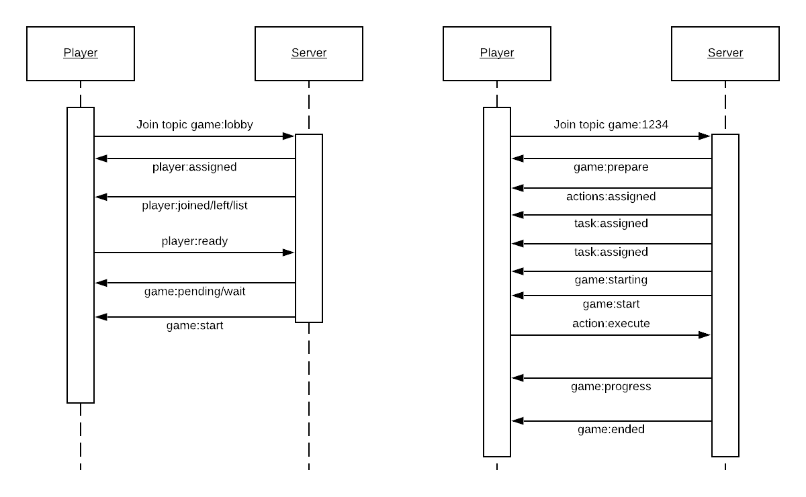

# NervesTeam Game Messaging

NOTE: This document is in a strange place since this repository has the game
logic and none of the Phoenix channel "glue". For training purposes, it seemed
like the easiest place to put it.

This document describes the game messaging between a NervesTeam game server and
clients over a Phoenix Channel connection.

NervesTeam clients are in two main states:

* Lobby - players connect here and wait for other players to join
* Game - after players start a game, control moves to the game state. New players can't join mid-game.

The Phoenix channel topic `game:lobby` handles messaging while in the lobby.
Once games begin, clients join a topic of the form `game:1234` where the number
represents the game instance.

## Basic types

### Players

One NervesTeam client supports one player. Each player has a single letter ID to
fit on the display.

```json
{
  "id": "a",
  "ready": false,
  "tasks": []
}
```

### Tasks

During the game, `Tasks` are given to each player. Each player receives a
different set of tasks, but any player can perform the task by running an
action. The `id` identifies the task. The `title` is what should be shown to the
player.

```json
{
  "id": "nerves_time",
  "title": "1970-01-01",
  "expire": 5000
}
```

### Actions

Each player has `Actions` that they may use to complete tasks. The `id`
identifies the action. The `title` is what should be shown to the player.

```json
  {
  "id": "nerves_time",
  "title": "nerves\ntime",
}
```

## Messages

### Lobby messages

Players always start in the lobby by joining `game:lobby`

#### player:ready

Direction: client -> server

Update the player ready state. Players need to set themselves to ready (true/false)
to be placed into a game. A game requires at least two ready players to begin.

```json
{
  "topic": "game:lobby",
  "event": "player:ready",
  "payload": {
    "ready?": true
  }
}
```

#### player:assigned

Direction: server -> client

The player id was assigned to the connection.

```json
{
  "topic": "game:lobby",
  "event": "player:assigned",
  "payload": {
    "id": "A"
  }
}
```

#### game:start

Direction: server -> client

If more then one player are ready, the server will start a game after a specified
delay. After the delay, if more than one player is still ready, the server will
send the `game:start` message to _all_ players who are in the ready state.

```json
{
  "topic": "game:lobby",
  "event": "game:start",
  "payload": {
    "game_id": "1234",
    "player_id": "A"
  }
}
```

#### player:joined

Direction: server -> client

When a player joins the lobby, the server broadcasts a `player:joined` message
to all clients.

```json
{
  "topic": "game:lobby",
  "event": "player:joined",
  "payload": {
    "id": "A"
  }
}
```

#### player:left

Direction: server -> client

Similarly when a player disconnects or leaves the lobby, the server sends a
`player:left` message to all remaining clients.

```json
{
  "topic": "game:lobby",
  "event": "player:left",
  "payload": {
    "id": "A"
  }
}
```

#### player:list

Direction: server -> client

For convenience, the server also broadcasts a `player:list` message when the list
of players in the lobby changes.

```json
{
  "topic": "game:lobby",
  "event": "player:list",
  "payload": {
    "players": [
      {"id": "A"}
    ]
  }
}
```

#### game:pending

Direction: server -> client

When more than one player is ready, the server sends the `game:pending` message
to inform all players that a new game will begin shortly.

```json
{
  "topic": "game:lobby",
  "event": "game:pending",
  "payload": {
    "duration": 2000
  }
}
```

#### game:wait

Direction: server -> client

If the server delivers a `game:pending` message and enough players become not
ready where the number of ready players < 1, the server cancels the pending
game and broadcasts the `game:wait` message.

```json
{
  "topic": "game:lobby",
  "event": "game:wait",
  "payload": {}
}
```

### Game messages

Once the client receives a `game:start` message in the lobby, it should join the
topic `game:<game_id>`. This begins the game. The following examples use 1234 as
the game_id.

#### action:execute

Direction: client -> server

Actions are associated to tasks. In order to win the game, tasks must have their
actions executed before the task expires. The server needs to know when an action
has been executed so it can update the game score.

```json
{
  "topic": "game:1234",
  "event": "action:execute",
  "payload": {
    "id": "nerves_time"
  }
}
```

#### actions:assigned

Direction: server -> client

Before the game starts, the server assigns two actions to each player.  Each
action contains the id to send to the server when invoked by the player and
the title text to show on the screen.

```json
{
  "topic": "game:1234",
  "event": "actions:assigned",
  "payload": {
    "actions": [
      {"id": "nerves_time", "title": "nerves\ntime"},
      {"id": "git_rebase", "title": "merge\nconflict"}
    ]
  }
}
```

#### task:assigned

Direction: server -> client

The server assigns tasks to players as needed. This occurs at the beginning of
the game and when tasks get completed by the current player or a teammate.

```json
{
  "topic": "game:1234",
  "event": "task:assigned",
  "payload": {
    "id": "nerves_time",
    "title": "1970-01-01"
  }
}
```

#### game:prepare

Direction: server -> client

Once all players join the game channel, the server broadcasts the `game:prepare`
message and then distributes the initial tasks and actions.  Then after the
specified duration, the client should expect a `game:starting` message.

```json
{
  "topic": "game:1234",
  "event": "game:prepare",
  "payload": {
    "duration": 1000
  }
}
```

#### game:starting

Direction: server -> client

This message indicates that the game will start soon.

```json
{
  "topic": "game:1234",
  "event": "game:starting",
  "payload": {
    "duration": 2000
  }
}
```

#### game:start

Direction: server -> client

After the `game:starting` duration , the server broadcasts `game:start` message
to mark the start of the game.

```json
{
  "topic": "game:1234",
  "event": "game:start",
  "payload": {}
}
```

#### game:progress

Direction: server -> client

The server broadcasts the percent complete at regular intervals. The percent
complete goes both ways as tasks get added by the server and tasks get completed
by players.

```json
{
  "topic": "game:1234",
  "event": "game:progress",
  "payload": {
    "percent": 100
  }
}
```

#### game:ended

Direction: server -> client

The server broadcasts the `game:ended` message when game is won (progress == 100)
or lost (progress == 0).

```json
{
  "topic": "game:1234",
  "event": "game:ended",
  "payload": {
    "win?": true
  }
}
```

## Message flow



